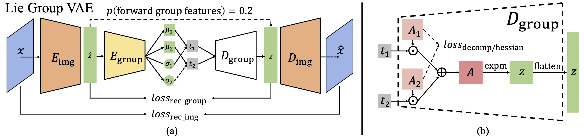

# CommutativeLieGroupVAE-Pytorch



Code for our paper [Commutative Lie Group VAE for Disentanglement Learning](https://arxiv.org/abs/2106.03375).

## Abstract

We view disentanglement learning as discovering an underlying structure that
equivariantly reflects the factorized variations shown in data.
Traditionally, such a structure is fixed to be a vector space with data
variations represented by translations along individual latent dimensions.
We argue this simple structure is suboptimal since it requires the model
to learn to discard the properties (e.g. different scales of changes,
different levels of abstractness) of data variations, which is an extra
work than equivariance learning. Instead, we propose to encode the data
variations with groups, a structure not only can equivariantly represent
variations, but can also be adaptively optimized to preserve the properties
of data variations. Considering it is hard to conduct training on group
structures, we focus on Lie groups and adopt a parameterization using
Lie algebra. Based on the parameterization, some disentanglement learning
constraints are naturally derived. A simple model named Commutative Lie Group
VAE is introduced to realize the group-based disentanglement learning.
Experiments show that our model can effectively learn disentangled
representations without supervision, and can achieve state-of-the-art
performance without extra constraints.

## Conference Poster


## Video Presentation

[](https://recorder-v3.slideslive.com/?share=38302&s=656ce8dd-35cd-4d7f-86c5-83d208e0e1dd)

## Requirements

* python == 3.6.12
* Numpy == 1.19.2
* pytorch == 1.7.1
* tensorboard == 2.3.0
* tqdm == 4.54.1
* h5py == 2.8.0
* Our code is based on
[this](https://github.com/MattPainter01/UnsupervisedActionEstimation)
repository, thus has the same following structure:
  * datasets: Stores PyTorch datasets and code to initialise them.
  * logger: Stores tensorboard logging and image generation code.
  * metrics: Stores all disentanglement metrics.
  * models: Stores all models used.
  * main.py: Defines the command line args to run training and executes the trainer.
  * trainer.py: Sets up parameters for training, optimisers etc.
  * training_loop.py: Defines the model independent training logic.
We use Anaconda for package management.

## Preparing datasets

**DSprites**
The training code will download the dataset
(dsprites_ndarray_co1sh3sc6or40x32y32_64x64.npz)
and convert it to img.npy file automatically (see
datasets/dsprites.py).
Just specify where (a directory) to store the downloaded dataset with
--data-path flag.

**3DShapes**
Download 3dshapes.h5 file from [here](https://github.com/deepmind/3d-shapes)
into a directory.
Use --data-path to specify the directory during training.

## Training

Pretrained checkpoints can be found
[here](https://drive.google.com/drive/folders/1ttIqYkHk2jCJep4DNow5B5uF-S8uP_A5?usp=sharing).

DSprites:
```
forward=0.2
hes=40
rec=0.1
com=0
for i in 0 1 2 3 4 5 6 7 8 9
do
    CUDA_VISIBLE_DEVICES=0 \
    python main.py \
        --model=lie_group \
        --epochs=70 \
        --batch-size=256 \
        --latents 10 \
        --learning-rate=1e-4 \
        --subgroup_sizes_ls '[100]' \
        --subspace_sizes_ls '[10]' \
        --lie_alg_init_scale 0.001 \
        --hy_hes ${hes} \
        --hy_rec ${rec} \
        --hy_commute ${com} \
        --forward_eg_prob=${forward} \
        --recons_loss_type=bce \
        --log-path=/path/to/results/lie_group_dsp_1mul100_rec${rec}_com${com}_hes${hes}_for${forward}_init0001 \
        --data-path=/path/to/dsprites_dir \
        --dataset=dsprites \
        --eval_data_path=/path/to/dsprites_dir \
        --eval_dataset=dsprites \
        --split=0
done
```

3DShapes:
```
forward=0.2
hes=20
rec=0.1
com=0
for i in 0 1 2 3 4 5 6 7 8 9
do
    CUDA_VISIBLE_DEVICES=1 \
    python main.py \
        --model=lie_group \
        --epochs=70 \
        --batch-size=256 \
        --latents 10 \
        --learning-rate=1e-4 \
        --subgroup_sizes_ls '[400]' \
        --subspace_sizes_ls '[10]' \
        --lie_alg_init_scale 0.001 \
        --hy_hes ${hes} \
        --hy_rec ${rec} \
        --hy_commute ${com} \
        --forward_eg_prob=${forward} \
        --recons_loss_type=l2 \
        --log-path=/path/to/results/CommutativeLieGroupVAE-Pytorch/lie_group_3ds_1mul400_rec${rec}_com${com}_hes${hes}_for${forward}_init0001 \
        --data-path=/path/to/3dshapes_dir \
        --dataset=shapes3d \
        --eval_data_path=/path/to/3dshapes_dir \
        --eval_dataset=shapes3d \
        --split=0
done
```

Recorded values and visualizations can be explored with tensorboard.

## Collect results

To collect results (metrics with mean and std) in a directory
of multiple models, we can run:
```
python collect_results.py \
    --in_dir /path/to/model_results \
    --result_file /path/to/model_results/aggregated_results.csv \
    --config_variables '[model, dataset, latents, subgroup_sizes_ls, subspace_sizes_ls, lie_alg_init_scale, hy_rec, hy_commute, hy_hes, forward_eg_prob, recons_loss_type]'
```

## Evaluation
To evaluate a checkpoint, run code (an example, where
the --log-path contains the target checkpoint):
```
forward=0.2
hes=20
rec=0.1
com=0
for i in 0
do
    CUDA_VISIBLE_DEVICES=1 \
    python main.py \
        --evaluate=True \
        --model=lie_group \
        --epochs=70 \
        --batch-size=256 \
        --latents 10 \
        --learning-rate=1e-4 \
        --subgroup_sizes_ls '[400]' \
        --subspace_sizes_ls '[10]' \
        --lie_alg_init_scale 0.001 \
        --hy_hes ${hes} \
        --hy_rec ${rec} \
        --hy_commute ${com} \
        --forward_eg_prob=${forward} \
        --recons_loss_type=l2 \
        --log-path=/path/to/results/CommutativeLieGroupVAE-Pytorch/lie_group_3ds_1mul400_rec${rec}_com${com}_hes${hes}_for${forward}_init0001/version_${i} \
        --data-path=/path/to/3dshapes_dir \
        --dataset=shapes3d \
        --eval_data_path=/path/to/3dshapes_dir \
        --eval_dataset=shapes3d \
        --split=0
done
```

## Citation

```
@inproceedings{Xinqi_liegroupvae_icml21,
author={Xinqi Zhu and Chang Xu and Dacheng Tao},
title={Commutative Lie Group VAE for Disentanglement Learning},
booktitle={ICML},
year={2021}
}
```
